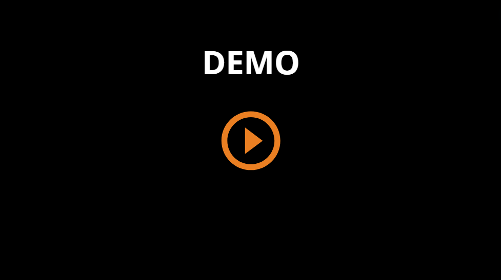

# DataPrism

## Introduction

DataPrism is a web application designed to simplify the cleaning, transformation, analysis, and division of datasets. It offers an intuitive interface that allows users to perform various data preprocessing tasks without the need for coding knowledge.

This project was realized as my end of studies project at the Faculty of Sciences of Monastir [FSM](http://www.fsm.rnu.tn/) for the academic year 2023-2024.

## Demo

To get a better understanding of how DataPrism works, you can watch the demo video below:

## Features

- **Data Import**: Import datasets in CSV format from local storage.
- **Data Exploration**: View and explore datasets in a user-friendly interface.
- **Data Analysis**: Perform descriptive statistics and visualize data distributions.
- **Data Transformation**: Discretize data, convert data types, and balance datasets using advanced algorithms.
- **Data Cleaning**: Manage missing values and outliers efficiently.
- **Data Division**: Split datasets for training and testing purposes.
- **Data Export**: Export processed datasets for further use.

## Technologies Used

- **Frontend**: Angular
- **Backend**: Django Rest Framework
- **Database**: MySQL (via XAMPP)

## Getting Started

### Prerequisites

- Python 3.7+
- Node.js and npm
- MySQL (via XAMPP)

### Installation

-we will provide this section later

   

## Usage

### User Account Management

- Sign up for a new account or log in with an existing account.

### Data Import

- Upload CSV files from your local storage.
- View the uploaded datasets in the sidebar.

### Data Exploration and Visualization

- Select a dataset to view in the data preview area.

### Data Analysis

- Perform descriptive analysis on the entire dataset or specific column.
- Visualize single variable distributions or correlations between variables using various chart types.

### Data Transformation

- Discretize data with equal width or equal frequency.
- Convert data types and balance (over-sampling / under-sampling) datasets with advanced algorithms like SMOTE and ADASYN.

### Data Cleaning

- Handle missing values with different imputation methods.
- correct outliers.

### Data Division

- Split datasets into training and testing sets.

### Data Export

- Export processed datasets for further use in machine learning or other applications.

### Acknowledgements

We would like to express my gratitude to:

- My academic advisor, [Dr. Salma Chaieb](https://www.linkedin.com/in/salma-chaieb-760908141/?lipi=urn%3Ali%3Apage%3Ad_flagship3_profile_view_base_recent_activity_content_view%3BMfa%2F9eySTMykum8fBikljQ%3D%3D), for her guidance and support.
- freeCodeCamp for their high-quality free courses.
- Stack Overflow for being an invaluable resource for troubleshooting and learning.
- The authors of the tutorials and resources that helped me throughout the development process.

## Resources

- [Django Rest Framework Documentation](https://www.django-rest-framework.org/)
- [Angular Documentation](https://angular.io/docs)
- Video tutorials:
  - [Django For Everybody - Full Python University Course](https://www.youtube.com/watch?v=o0XbHvKxw7Y)
  - [Build a Django REST API with the Django Rest Framework](https://www.youtube.com/watch?v=c708Nf0cHrs)
  - [CSV with Django](https://www.youtube.com/watch?v=04L0BbAcCpQ)
  - JWT Authentication:
    - [Angular](https://www.youtube.com/watch?v=brb4SO-dO_k&list=PL3ri6JBnBAbJne8wlRMyUhtVDa3C_HTQA)
    - [Django](https://www.youtube.com/watch?v=PUzgZrS_piQ&list=PL3ri6JBnBAbJne8wlRMyUhtVDa3C_HTQA&index=2)
  - [Angular](https://www.youtube.com/watch?v=VTEDh2pNSBQ)

